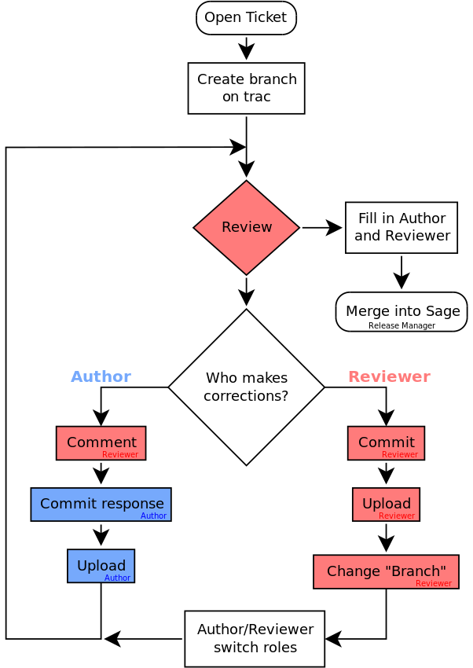

# Contributing to SageMath

From the [Sage Developer's Guide](http://doc.sagemath.org/html/en/developer/index.html):

> Everybody who uses Sage is
> encouraged to contribute
> something back to Sage
> at some point.


## How you can help

- Add examples to the documentation
- Find bugs or typos
- Fix a bug
- Implement a new function
- Contribute a useful tutorial for a mathematical topic
- Translate an existing document to a new language
- Create a new class, create a fast new C library, etc.


## Brief overview of the components

- [Trac server account](http://doc.sagemath.org/html/en/developer/trac.html#section-trac-account):
  used to create bug reports, discuss issues, propose changes, share
  code, ...

- [Source code](http://doc.sagemath.org/html/en/installation/source.html):
  You need your own copy of Sage's source code to change it.

- [Conventions and guidelines](http://doc.sagemath.org/html/en/developer/coding_basics.html):
  document outlining Sage's conventions and guidelines for code and
  documentation.

- [Git](https://try.github.io/levels/1/challenges/1):
  To share changes with the Sage community, you will need to learn
  about **revision control**; here is a [git cheat sheet](git-cheat-sheet.pdf).


## trac server

Let's explore the trac server and a few tickets:

- [trac server](https://trac.sagemath.org)

- [ticket #23622](https://trac.sagemath.org/ticket/23622)

- [ticket #9280](https://trac.sagemath.org/ticket/9280)

- [ticket #23446](https://trac.sagemath.org/ticket/23446)

- [ticket #23131](https://trac.sagemath.org/ticket/23131)

- [ticket #23568](https://trac.sagemath.org/ticket/23568)

- [ticket #23573](https://trac.sagemath.org/ticket/23573)


## git workflow

- configure git and obtain the source code ...

- create *or* download a branch::
```
git branch
git clone URL
```

- make changes: edit; rebuild; test; save (`git commit`)

- share changes::
```
git push
git pull
```


## git-trac workflow

- configure git, obtain the source code, **configure git-trac** ...

- create *or* checkout a **ticket**::
```
git trac create 'fix bug in Sage'
git trac checkout TICKETNUMBER
```
- make changes: edit; rebuild (`sage -br`); test

- share changes::
```
git commit
git trac push [TICKETNUMBER]
git trac pull
```


## Overview of the review process




## Getting ready for Sage development

### Getting Ready 1: Sign up for a trac account

Send an email to
[sage-trac-account@googlegroups.com](mailto:sage-trac-account@googlegroups.com)
with:

- your full name
- preferred username
- contact email
- and reason for needing a trac account

### Getting Ready 2: Generate and link SSH Keys

- [Generate SSH keys for your computer](http://doc.sagemath.org/html/en/developer/trac.html#generating-your-ssh-keys>):
```
ssh-keygen
```

- [Link your SSH keys with your trac account](http://doc.sagemath.org/html/en/developer/trac.html#linking-your-public-key-to-your-trac-account>):

    - Go to [http://trac.sagemath.org](http://trac.sagemath.org)
    - Log in with your trac username/password
    - Click on "Preferences"
    - Go to the "SSH Keys" tab
    - Paste the content of your public key file (e.g. `~/.ssh/id_rsa.pub`)
    - Click on "Save changes"

*(You will need to do this once for each computer that you will use for
Sage development, including CoCalc projects if you choose to use CoCalc for
Sage development).*

### Getting Ready 3: Configure git and git-trac

- install and configure [git](https://git-scm.com):
```
git config --global user.name "Your Name"
git config --global user.email you@yourdomain.example.com
```

- install [git-trac](https://github.com/sagemath/git-trac-command.git>):
```
git clone https://github.com/sagemath/git-trac-command.git
cd git-trac-command
python setup.py install
```

- configure `git-trac`::
```
git trac config --user username --pass password
```

### Getting Ready 4: Get the Sage source code

- get a copy of (the development version) of the Sage source code:
```
git clone git@trac.sagemath.org:sage.git
cd sage
git checkout develop
```

- build Sage:
```
make start
```

  *(this command will build Sage and test that Sage starts, but it will *not*
  build the documentation)*

- while Sage builds, visit the [trac server](http://trac.sagemath.org) and look
  for tickets that you would like to try, review, work, ... or create new
  tickets!


## Tips and Tricks

### checkout code from an old ticket without recompiling for hours

If you checkout the branch associated with a ticket using the command
```
git trac checkout TICKETNUMBER
```
then your version of Sage will coincide with the version of Sage on which the
branch is based. The big drawback here is that `make build` will compile an
older version of Sage, which can take a very, very long time.

Instead, you can attempt to merge the branch with the most recent version of
develop:
```
git checkout develop
git checkout -b t/TICKETNUMBER/TICKETNAME
git trach fetch TICKETNUMBER
git merge FETCH_HEAD
[git trac push]
```
Here is a short description of the above commands:

1. checkout the current develop branch of Sage
2. create a new branch (based off develop) with the name `t/TICKETNUMBER/TICKETNAME`
3. *fetch* the data associated with the branch on the ticket (but do not
   actually create the branch)
4. merge the fetched data into the current branch; this step might require
   conflict resolution
5. [optional, but good idea] share your changes: you updated the branch to the
   latest development version, and other people will find this helpful

